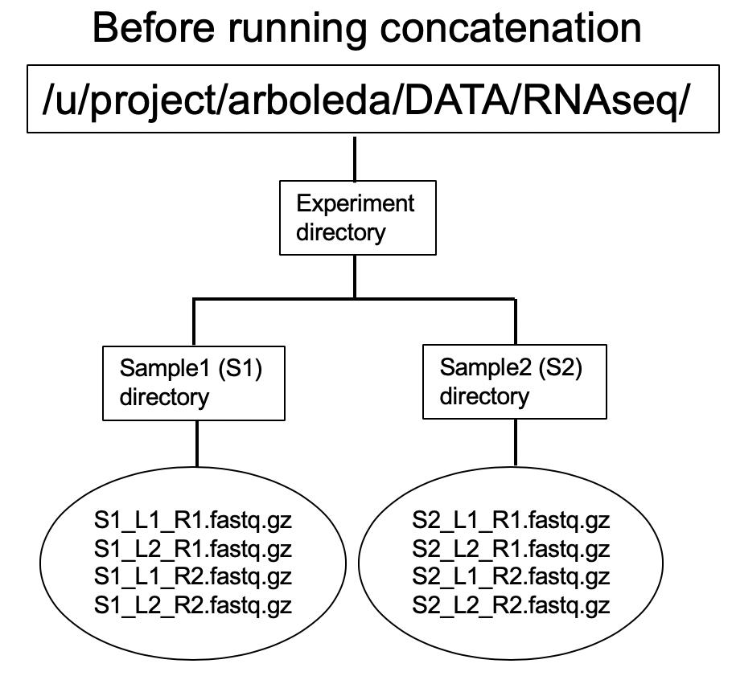
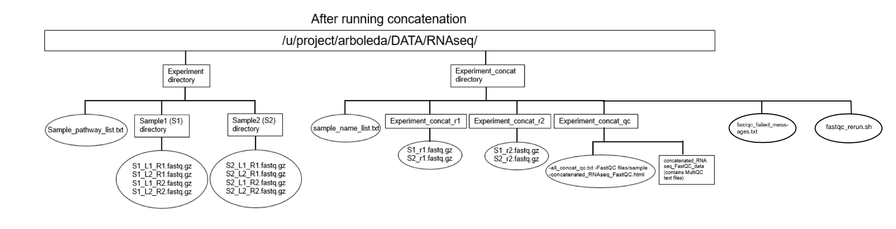

```{r setup, include=FALSE}
knitr::opts_chunk$set(echo = TRUE)
```

# Assumptions for this version of the concatenation:

1) This concatenation script works for both RNAseq and ATACseq. If you want to run the script on RNAseq data, make sure your
RNAseq data is in */u/project/arboleda/DATA/RNAseq/* on the Cluster. If you want to run the script on ATACseq data, make sure your
ATACseq data is in */u/project/arboleda/DATA/ATACseq/* on the Cluster.

2) User is going to give the experiment folder, and there are subdirectories within it.

3) These subdirectories are samples. 

4) The samples contain **PAIRED** fastq reads that are made up of different **LANES** that are all **ZIPPED**. 

The user must be logged into the Cluster to use the following scripts.

# Input



# Output


# 1) Concatenating reads (~1 hour)
The following command will generate the directories to hold concatenated output, concatenate sample reads together, and run FastQC on the samples. 

Prior to running the script, the user should take down the following information in a text editor:

1. the name of the experimental directory, ending with a slash (aka /), inside of */u/project/arboleda/DATA/RNAseq/* or */u/project/arboleda/DATA/RNAseq/ATACseq*.
2. The absolute pathway where the user would like to store the Cluster's job messages.

Calling `generate_user_submit_concat_array.sh` will generate directories required for concatenation and then produce a series of prompts the user should answer by typing and pressing 'Enter'. 
While answering these prompts, the user should keep in mind the following:

1. **Do not use spaces in any of the answers.** Instead, use a dash ('-') or underscore ('_').
2. If the user wishes to terminate the script, then kill the script by typing `Control` and `C` simultaneously.
3. If the user decides to receive job email notifications, they will get 2 emails per sample processed. This may not be desirable if the user if processing many samples.

```{bash, eval=FALSE}
bash /u/project/arboleda/angelawe/RNAseq_Scripts/concatenation_scripts/generate_user_submit_concat_array.sh 
```
### The questions are as follows:
#### Are you performing RNAseq or ATACseq? Answer RNAseq or ATACseq.
- Make sure your answer is spelled exactly as RNAseq or ATACseq with correct upper/lower cases. The script will prompt again until it matches.
- The answer will be used to locate your data. Therefore, if you answered RNAseq but put your data in the ATACseq directory, it won't work.

#### What is the directory inside /u/project/arboleda/DATA/RNAseq/ you are concatenating? Make sure the name is spelled exactly the same and ends with a slash, aka /
- The script will keep prompting until your answer contains a slash at the end.
- The directory for the output will be created. If the output directory already exists, the script will display the directory name and exit. Make sure you delete (rm -r dir_name) or rename (mv dir_name new_dir_name) the old directory before running again. 

#### What is your name? Type your name following the format FirstName-LastName and press enter
- This is used to give a default name to the generated wrapper script

#### What is the absolute path where you would like to put the job error and output messages? Make sure it ends with a slash, aka '/'
- The script will keep prompting until your answer contains a slash at the end.

#### Would you like email notifications for when each sample concatenation begins? Answer YES or NO
- Refer to number 3 above for more details.

#### File $FILE_PATH (i.e. /u/project/arboleda/DATA/Scripts/User-RNAseq/User-RNAseq-Concatenation/David-Jin_sample_run_2024-08-22_submit_concat_array.sh) already exists. Do you want to overwite its current content? Answer YES or NO
- This question will appear if the default name for the wrapper script is taken. This can happen if you run concatenation on the same sample directory multiple times on the same day. 
- Answer YES if you want to overwrite the old script. This should not be an issue unless you need the old script
- If you answer NO, you will be asked to give a name of your choice. Make sure it ends with ".sh" so it is a shell script.
  - If you changed your mind and wish to overwite the old script, just type OVERWRITE.

After answering the questions, the script will submit **THREE** jobs, one will `qsub` a wrapper script that will call the `concat_array.sh` script (the name of the wrapper script and job will show on the screen), and two others for error checking. If the user would like to view their wrapper script generated, type `cd /u/project/arboleda/DATA/Scripts/User-RNAseq/User-RNAseq-Concatenation/` and then `less name_of_wrapper_script.sh` (press `q` to exit `less`). 

If the user would like to see the status of the job, then type `myjobs` into the command line. How long it takes for the Cluster to start running the job will depend on the demand the Cluster is experiencing that day, but with no wait time the concatenation should take about an hour.

The user will see two other jobs ("error_catching" and "create_rerun_script") with status "hqw". They will start running once the array job completes. These two jobs are very short.

# 2) Error Catching
After the job finishes, you will have one/three files in the concat directory. 

### fastqc_failed_messages_{jobID}.txt
The user can either output the content to terminal (cat fastqc_failed_messages_{jobID}.txt) or use a text editor to look inside. This file has the status of every task in the job array and whether they failed. The format is:
```text
=========================
task id: 1
BALcells-1Xshield_r1 failed: started but did not finish due to execd enforced h_rt limit
BALcells-1Xshield_r2 failed: did not start. Potentially due to previous error in *r1
=========================
task id: 2
H7-set1_r1 succeeded
H7-set1_r2 succeeded
```

If everything succeeded without error, then no other files will be created.

### fastqc_failed_index_{jobID}.txt
If fastqc failed on some samples, then this file will hold the path to those failed samples. It will be used for the rerun script. The format is: 
```text
/u/project/arboleda/DATA/RNAseq/sample_run3_concat/sample_run3_concat_r1/BALcells-1Xshield_r1.fastq.gz
/u/project/arboleda/DATA/RNAseq/sample_run3_concat/sample_run3_concat_r2/BALcells-1Xshield_r2.fastq.gz
```
### fastqc_rerun_{jobID}.sh
This script will rerun fastqc on those failed samples with increased memory and time limit. In order to run this script, the user can execute the following command while inside this directory (make sure to substitute {jobID} with the actual jobID):

```{bash, eval=FALSE}
qsub fastqc_rerun_{jobID}.sh
```


# 3) Organizing QC data (~10 min)
This step will just put the qc output into a more readable format. The user should complete this step on an interactive node; enter `qrsh`.

First the user should `cd` into the *Experiment_Name_concat_qc* directory. The user should type the following into the command line while inside this directory:
```{bash, eval=FALSE}
bash /u/project/arboleda/angelawe/RNAseq_Scripts/concatenation_scripts/qc_concat.sh 
```

(Ignore any warnings that come up, they will not affect the output).
While inside the *Experiment_concat_qc* directory, the user can use `less all_concat_qc.txt` into the command line to view the lines/characters of the concatenated/unconcatenated reads. When done viewing, the user will type `q` to exit. **The number of lines/characters in the concatenated R1/R2 reads and un-concatenated R1/R2 reads of one sample should be the same.**  

This script will use MultiQC to combine all the sample FastQC HTML files into one HTML file, called *concatenated_RNAseq_FastQC.html* inside *Experiment_Name_concat_qc*. The HTML file will contain visualizations of the FastQC data, however it cannot be viewed on the Cluster. The user will need to have Cyberduck installed to download the file and view them on their own computer if they would like to inspect them.

MultiQC also generates a directory as a companion to the HTML file, called *concatenated_RNAseq_FastQC_data*. This directory contains text files that give numerical information about the concatenated reads; these can also be downloaded to a personal computer and viewed in R or Excel.

# Optional: Clearing up memory
After concatenation, **ask Angela, Val, or Leroy** if it is possible to delete the raw reads.