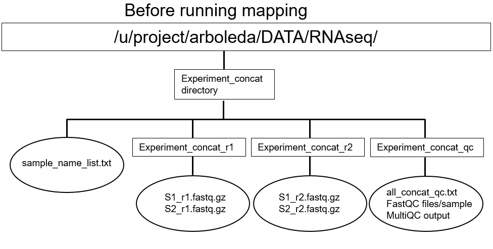
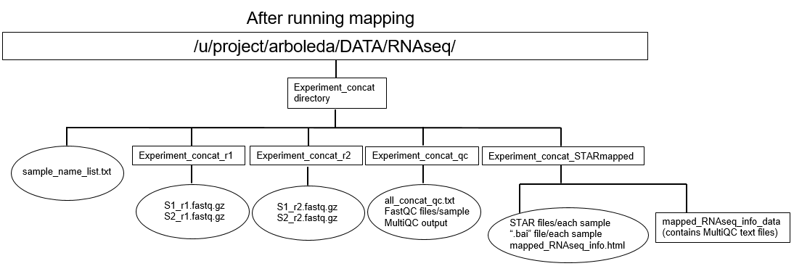

```{r setup, include=FALSE}
knitr::opts_chunk$set(echo = TRUE)
```

# Assumptions
1. The user has concatenated the RNAseq reads using previous concatenation scripts; the concatenated reads have been left in the directory they were generated in.
2. The user has checked the QC documents from concatenation and has ensured that *(a)* line/character counts of the concatenated and raw reads and *(b)* that the reads are of good quality.
3. The genome index for the read length of the samples have been previously generated. Make sure to check the readlength given from FastQC to determine which genome index overhang is required for your data set.
  + Currently have genome indices produced for overhangs of 74 and 150 (max read lengths of 75 and 151, respectively) as of 12 Aug. 2019.

# Input


# Output


# 1) STAR Mapping (~2 hours)
The user will call `generate_user_submit_STAR_mapping.sh` script, which will generate the directories to pass to the actual mapping script, as shown on the screen. It will then proceed to ask the user for input. Prior to submitting this script, the user should have the following information ready in a text editor:

1. the name of the experimental directory inside */u/project/arboleda/DATA/RNAseq/* that the user would like to analyze, ending with a slash (/)
2. absolute path of the directory they want to store the job messages the cluster automatically generates, ending with a slash (/).
3. ideal overhang length for their data set. Formula: $OverhangLength = MaxReadLength - 1$
  + To check to the genome indices previously generated, `cd /u/project/arboleda/DATA/REFERENCE_GENOMES/GR38/STAR_GENOME_INDICES` and `ls`
  + If a genome index with an overhang length  appropriate for the user's data does not exist, then the user should use *Example_genome_index_generation_notes.html* as directions to generate a new genome index (or, preferrably, ask Angela).

While answering the questions, the user should keep the following in mind:

1. **Do not use spaces in any of the answers.** Instead, use a dash ('-') or underscore ('_').
2. If the user submits an incorrect answer, then kill the script by typing `Control` and `C` simultaneously.
3. If the user decides to receive job email notifications, they will get 2 emails per sample processed. This may not be desirable if the user if processing many samples.

The command to do call `generate_user_submit_STAR_mapping.sh` is as follows:
```{bash, eval=FALSE}
bash /u/project/arboleda/angelawe/RNAseq_Scripts/STAR_mapping_scripts/generate_user_submit_STAR_mapping.sh 
```
### The questions are as follows:
#### What experiment directory inside /u/project/arboleda/DATA/RNAseq/ are you analyzing? Make sure it ends with a slash, /
- The script will keep prompting until your answer contains a slash at the end.
- The directory for the output will be created. If the output directory already exists, the script will display the directory name and exit. Make sure you delete (rm -r dir_name) or rename (mv dir_name new_dir_name) the old directory before running again. 

#### What is your name? Type your name following the format FirstName-LastName and press enter
- This is used to give a default name to the generated wrapper script

#### What is the absolute path where you would like to put the job error and output messages? Make sure it ends with a slash, aka '/'
- The script will keep prompting until your answer contains a slash at the end.

#### Would you like email notifications for when each sample concatenation begins? Answer YES or NO
- Refer to number 3 above for more details.

#### What overhang length are you using? (This number is the max readlength minus 1) 
- Refer to 1) (3) above for more details on how to find overhang length. 

#### File $FILE_PATH (i.e. /u/project/arboleda/DATA/Scripts/User-RNAseq/User-RNAseq-Concatenation/David-Jin_sample_run_2024-08-22_submit_concat_array.sh) already exists. Do you want to overwite its current content? Answer YES or NO
- This question will appear if the default name for the wrapper script is taken. This can happen if you run STARmapping on the same sample directory multiple times on the same day. 
- Answer YES if you want to overwrite the old script. This should not be an issue unless you need the old script
- If you answer NO, you will be asked to give a name of your choice. Make sure it ends with ".sh" so it is a shell script.
  - If you changed your mind and wish to overwite the old script, just type OVERWRITE.
  
  
After answering the questions, the script will generate and `qsub` a wrapper script that will call the `STAR_mapping_array.sh` script (the name of the wrapper script and job will show on the screen). If the user would like to view their wrapper script generated, type `cd /u/project/arboleda/DATA/Scripts/User-RNAseq/User-RNAseq-STAR-mapping` and then `less name_of_wrapper_script.sh` (press `q` to exit `less`). 

If the user would like to see the status of the job, then type `myjobs` into the command line. How long it takes for the Cluster to start running the job will depend on the demand the Cluster is experiencing that day, but with no wait time the concatenation should take about two hours.

# 2) Error Catching
After the job finishes, you will see the following files inside your concat directory:

### STAR_failed_messages_{jobID}.txt
The user can either output the content to terminal (cat STAR_failed_messages_{jobID}.txt) or use a text editor to look inside. This file the status of every task in the job array and whether they failed. The format is:
```text
=========================
task id: 1
BALcells-1Xshield_Log.final.out found
BALcells-1Xshield_SJ.out.tab found
=========================
task id: 2
H7-set1_Log.final.out found
H7-set1_SJ.out.tab found
=========================
task id: 3
VFI-005_Log.final.out not found: due to execd enforced h_rt limit
VFI-005_SJ.out.tab not found: due to execd enforced h_rt limit
```

In this case, we know STARmapping failed on sample VFI_005. 

### STAR_failed_index_{jobID}.txt
If star mapping failed on some samples, then this file will hold the index of those failed samples within sample_pathway_list.txt. It will be used for the rerun script. The format is: 
```text
3
```

### STAR_rerun_{jobID}.sh
This script will rerun STAR mapping on those failed samples with increased memory and time limit. In order to run this script, the user can execute the following command while inside this directory (make sure to substitute {jobID} with the actual jobID):

```{bash, eval=FALSE}
qsub STAR_rerun_{jobID}.sh
```

# 3) Viewing STAR outputs
The user should `cd` into the *Experiment_Name_concat_STARmapped* directory. This directory should hold all the STAR outputs for each sample. 

After STAR mapping is complete, the following files for each sample should be produced:
STAR mapping files (for each sample mapped):

1. ${sample_name}_Aligned.sortedByCoord.out.bam

2. ${sample_name}_Log.final.out

3. ${sample_name}_Log.out

4. ${sample_name}_Log.progress.out

5. ${sample_name}_SJ.out.tab

6. ${sample_name}_Unmapped.out.mate1

7. ${sample_name}_Unmapped.out.mate2

STAR also generates "${sample_name}_STARtmp_" directories; I believe they should have been removed by STAR after mapping is complete (In my test cases, these directories have been empty.)

To make sure all outputs were generated, the user should *cd* into the "ExperimentName_concat_STARmapped" directory and type the following command to count the number of files in this directory.
```{bash, eval=FALSE}
ls -1 | wc -l
```
The number of files in this directory should be equal to **(8)(number of samples)**. This formula includes the extra, empty tmp directories that STAR/2.7.0e generates; if not considering these directories, replace 8 with 7. 

Reccommended to read through these documents:

1. ${sample_name}_Log.final.out: This file will give summary stats about the mapping for this sample.

2. ${sample_name}_Log.out: This file will give more detail to the parameters selected for the mapping of this sample (this file automatically records what command was used to run the mapping) and if any warning messages are produced, they are recorded here.

# 3) Processing STAR outputs
Reccommended: do this step on an interactive node. To get one, type `qrsh` into the Cluster command line. Then `cd` into the *Experiment_name_concat_STARmapped* directory.

While inside the directory that contains the mapped reads, the user can type the following:
```{bash, eval=FALSE}
qsub /u/project/arboleda/angelawe/RNAseq_Scripts/STAR_mapping_scripts/processing_STARoutput.sh
```
This step will generate 'bai' files for each 'bam' file, which is required for viewing the mapped reads in IGV. It will also combine all information from the "Log.final.out" into one HTML file, "mapped_RNAseq_info.HTML". To view this file, the user should use Cyberduck to download it and open it on their own computer. A directory, called *mapped_RNAseq_info_data* will also be generated by MultiQC, which contains numeric data about the data set that can be downloaded and viewed in R or Excel. 

The user will receive an email when the job starts and stops. 

# 4) Viewing BAM files
If the user would like to view the mapped reads contained in the BAM file through IGV, the user will need to set up Cyberduck and download the specific "bam" file and the associated "bai" file to their personal computer. They can then open the "bam" file in IGV (these reads are in GR38).

The mapped reads are pretty large (what I have tested so far, ~4-5G), the user should make sure their internet connection is stable enough to download them onto their computer AND that their computer has enough memory to store them. 

